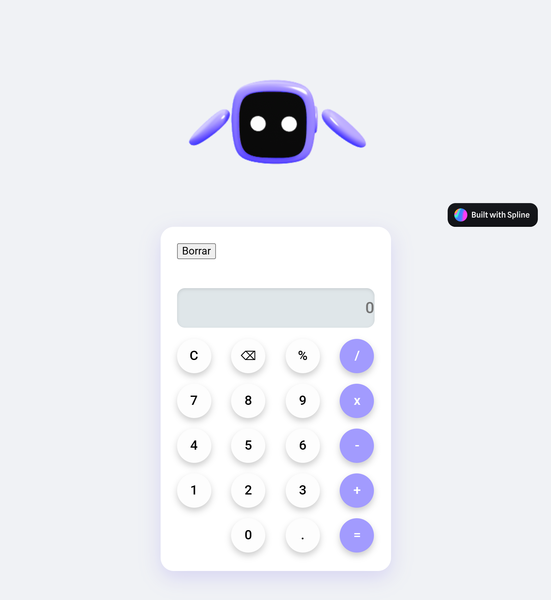

 <h2 align="center">Project: <a href="https://calculadora-steel-six.vercel.app">Calculadora</a></h2> 

# 🧮 Calculadora (Calculator App)

A sleek and modern calculator built with HTML, CSS, and JavaScript. Features a clean interface with smooth animations and full functionality for basic mathematical operations.

## 🚀 What's Inside

- **HTML5** - Semantic structure and accessibility features
- **CSS3** - Modern design with smooth animations and responsive layout
- **Vanilla JavaScript** - Complete calculator logic and event handling
- **Clean UI** - Minimalist design inspired by modern calculator apps

## 📁 File Structure

```
Calculadora/
├── index.html          # Main calculator interface
├── style.css           # Beautiful styling and animations
├── script.js           # Calculator logic and operations
└── README.md           # Project documentation
```

## 🎯 How to Start (3 Simple Steps)

1. **Download** - Clone or download this repository
2. **Open** - Double-click on `index.html` in any web browser
3. **Calculate** - Start performing calculations right away!

No setup required - just open and use!

## ✨ Features

- **Basic Operations** - Addition, subtraction, multiplication, division
- **Clear Functions** - C (clear all) and backspace functionality
- **Decimal Support** - Handle decimal numbers with precision
- **Responsive Design** - Works perfectly on desktop and mobile
- **Smooth Animations** - Button press effects and transitions
- **Error Handling** - Prevents invalid operations

## 🎨 Easy Customization

Perfect for learning and experimenting:

- **Colors**: Change the purple theme in `style.css`
- **Button Layout**: Modify the grid structure in `index.html`
- **Animations**: Adjust hover effects and transitions
- **New Operations**: Add square root, percentage, or memory functions
- **Themes**: Create dark/light mode toggle
- **Sounds**: Add click sounds for button presses

## 🌐 Free Hosting Options

Share your calculator online:

- **GitHub Pages** - Enable Pages in your repository settings
- **Netlify** - Drag your project folder to netlify.com
- **Vercel** - Connect GitHub repo for instant deployment
- **CodePen** - Great for showcasing and getting feedback

## 💡 Beginner Tips

- **Study the logic**: Understanding how calculations are stored and processed
- **Experiment safely**: Try changing button colors first
- **Test edge cases**: What happens with division by zero?
- **Mobile first**: Test how it looks on different screen sizes
- **Code comments**: Add your own comments to understand each function

## 🔧 Learning Opportunities

This project teaches:
- **Event handling** - How buttons trigger functions
- **String manipulation** - Processing mathematical expressions
- **DOM manipulation** - Updating the display dynamically
- **CSS Grid/Flexbox** - Modern layout techniques
- **Error handling** - Managing invalid inputs gracefully

## 📚 Next Steps

Ready to level up? Try adding:
- Memory functions (M+, M-, MR, MC)
- Scientific operations (sin, cos, tan, √)
- History of calculations
- Keyboard input support
- Multiple themes

## 🎯 Learning Resources

- [MDN Web Docs](https://developer.mozilla.org/) - Complete web development reference
- [CSS-Tricks](https://css-tricks.com/) - CSS layout and animation guides
- [JavaScript.info](https://javascript.info/) - Modern JavaScript concepts
- [freeCodeCamp](https://freecodecamp.org/) - Free coding bootcamp

## 🎉 Perfect For

- **First JavaScript project** - Learn event handling and DOM manipulation
- **CSS practice** - Master modern layouts and animations
- **Portfolio piece** - Show off your front-end skills
- **Learning math logic** - Understand how calculators work internally

**Ready to calculate?** Start by changing the button colors and see your creativity come to life!
